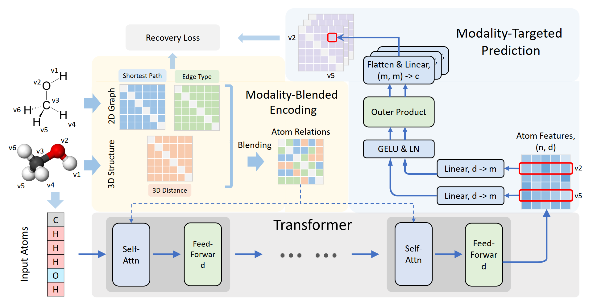

# Multimodal Molecular Pretraining via Modality Blending

This repository contains a Pytorch  implementation of the paper [Multimodal Molecular Pretraining via Modality Blending](https://arxiv.org/abs/2307.06235) (ICLR 2024).



## Installation

- Clone the repository

```shell
git clone https://github.com/YudiZh/MoleBlend.git
cd ./MoleBlend
```
- Install the dependencies
  
```shell
conda env create -f requirement.yaml
conda activate MOLEBLEND
pip install torch==1.7.1+cu110 torchvision==0.8.2+cu110 torchaudio==0.7.2 -f https://download.pytorch.org/whl/torch_stable.html
pip install torch_geometric==1.6.3
pip install torch_scatter==2.0.7
pip install torch_sparse==0.6.9
pip install azureml-defaults
pip install rdkit-pypi cython
pip install einops==0.6.1
pip install lmdb
pip install pickle5
python setup.py build_ext --inplace
python setup_cython.py build_ext --inplace
pip install -e .
pip install --upgrade protobuf==3.20.1
pip install --upgrade tensorboard==2.9.1
pip install --upgrade tensorboardX==2.5.1
```

## Pre-trained Model

- Download Link: [MoleBlend](https://1drv.ms/u/s!Ag_qNcc92TqcjmK_ytaspq1rffNo?e=PJ8dHQ)

## Training a new Model

```shell
export data='./data/PCQM4Mv2'               # path to data
bash shells/pretrain-moleblend-run.sh
```
Train on 4 NVIDIA Tesla A100 GPUs (40GB).

## Finetune on Downstream Task (MoleculeNet)

You can download the dataset by referring to [Uni-Mol Datasets](https://github.com/deepmodeling/Uni-Mol/blob/931a31f1da729bbe5f3cf18025465a3ddba72632/unimol/README.md?plain=1#L28) first.

The following is an example of fine-tuning on the toxcast task.

```shell
export count=30
export data="./data/molecular_property_prediction" # path to moleculenet data
export pretrain_ckpt_file="pretrained_ckpt.pt" # path to pretrained checkpoints
export wandb_sweep_config="wandb_sweep_config/toxcast_config.yaml" # path to the task wandb config file
python3 -m wandb sweep --project moleblend_molnet $wandb_sweep_config
# copy the wandb sweep url
python3 -m wandb agent --count $count $url
```

## Citation
```
@inproceedings{yu2024multimodal,
  title={Multimodal Molecular Pretraining via Modality Blending},
  author={Yu, Qiying and Zhang, Yudi and Ni, Yuyan and Feng, Shikun and Lan, Yanyan and Zhou, Hao and Liu, Jingjing},
  booktitle={The Twelfth International Conference on Learning Representations},
  year={2024}
}
```

## Acknowledgements

We would like to thank for the code from [Fairseq](https://github.com/facebookresearch/fairseq) and [Transformer-M](https://github.com/lsj2408/Transformer-M) repositories.
